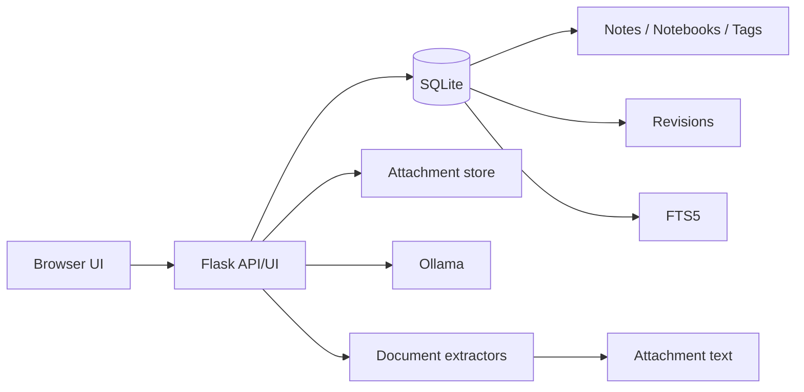
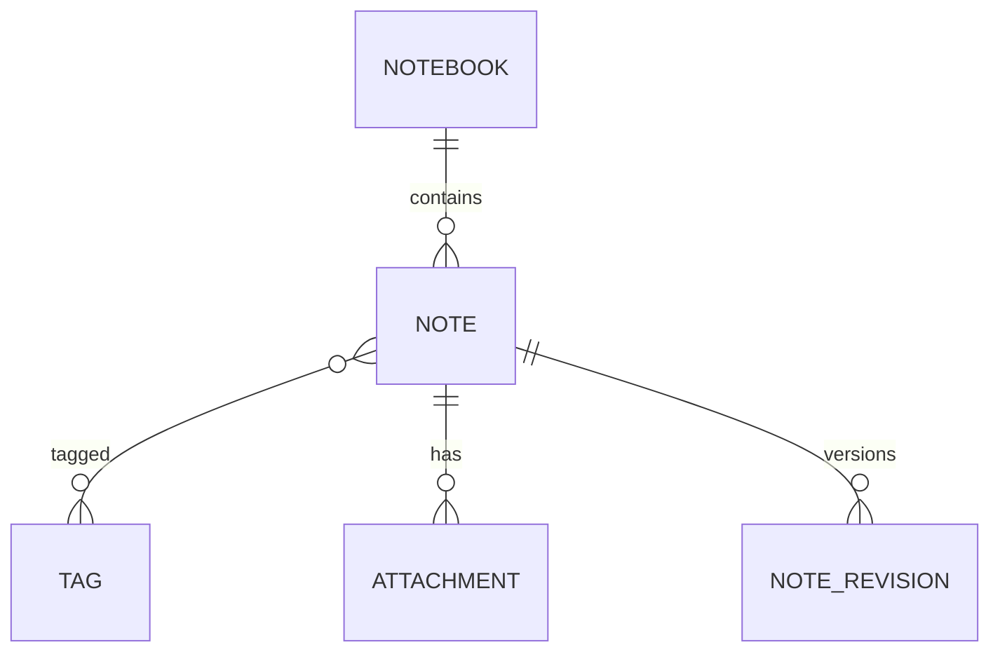
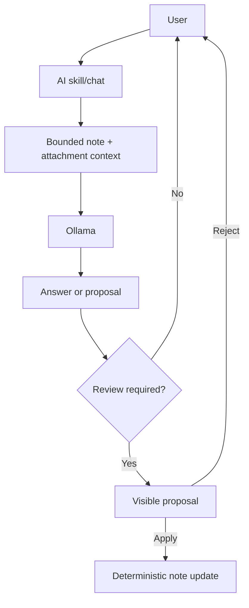

# Notes v2 Design & Implementation Document

## Product role

Notes is the fast capture and retrieval layer in the local application set. It is intentionally smaller than Context Studio: Notes is for quick personal/work knowledge, while Context Studio remains the heavyweight governed project/document workspace.

## Architecture

### Reused patterns

- **Context Studio** — Markdown/document workspace, scoped assistant concepts, Skills and review-first changes.
- **FileWeaver** — local/remote Ollama configuration, visible model selection and the rule that LLM output proposes rather than mutates.
- **PackBridge** — provenance-oriented document extraction and controlled deterministic application behaviour around AI.
- **General Search** — Markdown-first answer/export direction; web research integration is reserved for v2.2 rather than copied into the core.
- **localLLM** — future optional embedded GGUF provider behind the same application-level AI boundary.

## Data model

The v1 `note` table is retained. New columns are added in place and existing notes are assigned to an `Inbox` notebook.

## AI boundary

AI never performs direct database or filesystem mutation.

Title, content and tag skills return proposals. The browser applies them only after the user chooses Apply, then the normal autosave API persists the change.

## Search

SQLite FTS5 is used when available. Search falls back to case-insensitive title/content matching and attachment extracted-text matching when FTS5 is unavailable or rejects a query.

Semantic/embedding search is deliberately deferred to v2.1 so v2 search remains fast and dependency-light.

## Attachments

Files are stored under `instance/uploads` with UUID filenames. Original filenames are retained only as metadata. Text extraction is bounded before persistence. v2 supports PDF, Word, Excel, PowerPoint and common text formats.

## Revision policy

Autosave can occur frequently, so Notes does not create a revision for every keystroke. It snapshots the previous note state before meaningful content/title changes, but suppresses additional automatic snapshots within a five-minute window. Archive/Trash and revision restore force a snapshot.

## Deployment compatibility

`app.py` remains the entry point. The default port is aligned with the verified Ubuntu deployment at 5063. Runtime state remains under Flask `instance/` and is excluded from Git.
